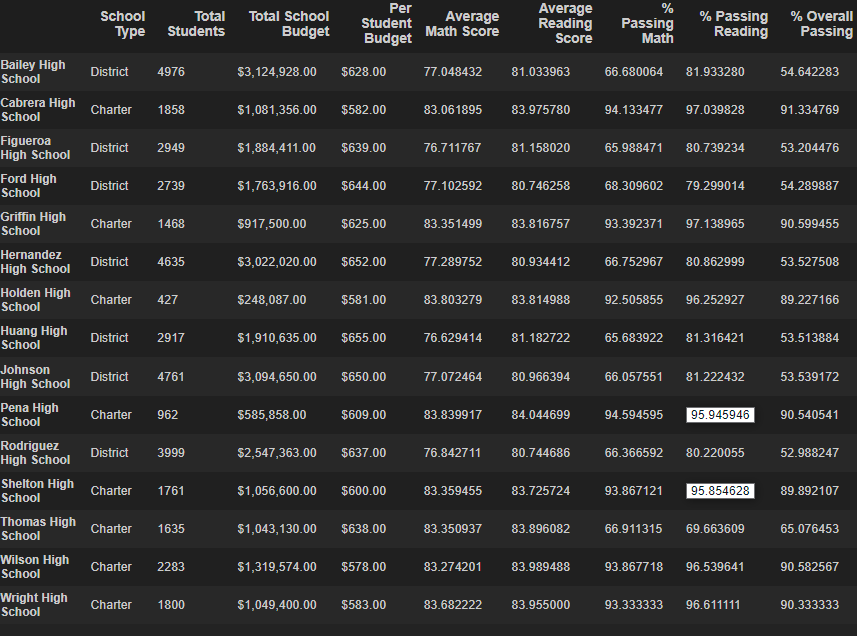

# School_District_Analysis

## Overview of the school district analysis
The purpose of this school district analysis for PyCity Schools is to repeat the previous school district analysis, due to potential alteration of ninth grade reading and math scores at Thomas High School.  In order to uphold state-testing standards and provide the most accurate reporting, a new school district analysis was requested by the school board. All Thomas High School ninth grade reading and math scores were replaced with NaNs in order to exclude those scores from being tabulated, and a new Thomas High School-specific analysis was run on the included tenth through twelfth grade, as well as a new per-school summary, lists of high and low performing schools with metrics, math and reading scores by grade, scores by school spending, scores by school size, and scores by school type to include the new calculations for Thomas High School. 

## Results
- How is the district summary affected?

The original district summary (below) shows slightly higher math and reading average scores and percentages than the updated analysis which replaced the Thomas High School ninth grade scores with NaNs.

 Following the replacement of the scores (below), average math scores dropped by 0.1 while average reading scores stayed the same.  The percentage of students passing math dropped 0.2%, passing reading dropped 0.3%, and the overall percentage of students passing both math and reading dropped 0.1%.    

- How is the school summary affected?

The original school summary (below) showed Thomas High School  with an average math score of 83.418, average reading score of 83.848, with passing math percentage of 93.272%, passing reading percentage of 97.308%, and overall passing percentage for both math and reading of 90.948%.  

Post-replacement of ninth grade scores with NaNs, the school summary (below) shows average math score dropped approximately 0.07 points to 83.350, and average reading score rose approximately 0.05 points to 83.896, showing minimal impact.  However, the % passing math, reading and overall passing dropped significantly due to the ninth grade students being included in the full school's student count for calculating percentages.    

After recalculating percentages to include only tenth through twelfth grade students in the school's student count (below), the average math and reading scores stayed the same while the % passing math, reading and overall passing rebounded to 93.185% for percentage passing math, 97.018% for percentage passing reading, and 90.630% for overall passing percentage for both math and reading. These percentages show a drop from the original school summary percentages of approximately 0.09% for math, 0.29% for reading, and 0.32% overall.  

- How does replacing the ninth graders' math and reading scores affect Thomas High School's performance relative to the other schools?

- How does replacing the ninth-grade score affect the following:
    - Math and reading scores by grade
    
    Original math scores by grade: 
    
    
    
    Updated math scores by grade: 
    
    
    
    Original reading scores by grade:
    
    

    Updated reading scores by grade: 
    
    
    
    There were no changes to both average math and reading scores following the replacement of the ninth-grade scores with NaNs, with the exception of the 9th grade Thomas High School data post-update to reflect no grades for math or reading.  
    
    - Scores by school spending  

    Original scores by school spending: 
    
    
    
    Updated scores by school spending: 
    
    
    
    Changes to scores by school spending were minimal and did not affect the rounded average math and reading scores, or the passing math, passing, reading, and overall passing percentages. 
    
    - Scores by school size

    Original scores by school size:
    
    
    
    Updated scores by school size:
    
    
    
    Overall, changes to scores by school size from the original summary were so minimal as to not affect the rounded average math and reading scores, or the passing math, passing reading, or overall passing percentages. 
    
    - Scores by school type

    Original scores by school type: 

    
    
    Updated scores by school type: 
    
    
    
    Changes to scores by school type from the original summary were minimal and did not affect the rounded average math and    reading scores, or the passing math, passing reading, or overall passing percentages. 

## Summary
Summarize 4 changes in the updated school district analysis after reading and math scores for the ninth grade at Thomas High School have been replaced with NaNs.
