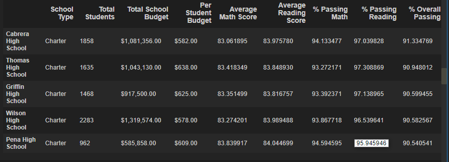
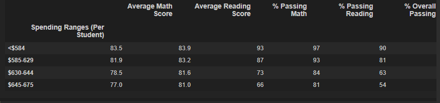

# School_District_Analysis

## Overview of the school district analysis
The purpose of this school district analysis for PyCity Schools is to repeat the previous school district analysis, due to potential alteration of ninth grade reading and math scores at Thomas High School.  In order to uphold state-testing standards and provide the most accurate reporting, a new school district analysis was requested by the school board. All Thomas High School ninth grade reading and math scores were replaced with NaNs in order to exclude those scores from being tabulated, and a new Thomas High School-specific analysis was run on the included tenth through twelfth grade, as well as a new per-school summary, lists of high and low performing schools with metrics, math and reading scores by grade, scores by school spending, scores by school size, and scores by school type to include the new calculations for Thomas High School. 

## Results
- How is the district summary affected?

- How is the school summary affected?

- How does replacing the ninth graders' math and reading scores affect Thomas High School's performance relative to the other schools?

- How does replacing the ninth-grade score affect the following:
    - Math and reading scores by grade
    
    
    
    
    
    
    
    
    
    - Scores by school spending  test
    
    
    
    
    
    - Scores by school size

    
    
    
    
    - Scores by school type

    
    
    

## Summary
Summarize 4 changes in the updated school district analysis after reading and math scores for the ninth grade at Thomas High School have been replaced with NaNs.
